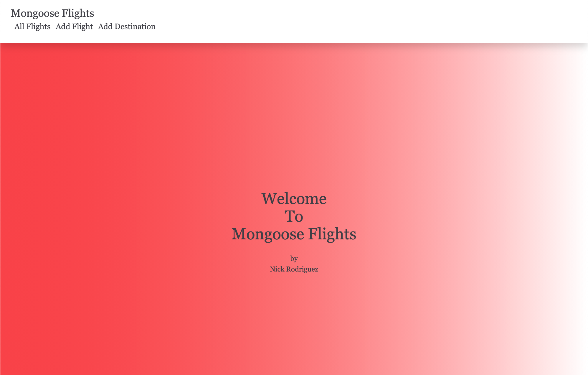
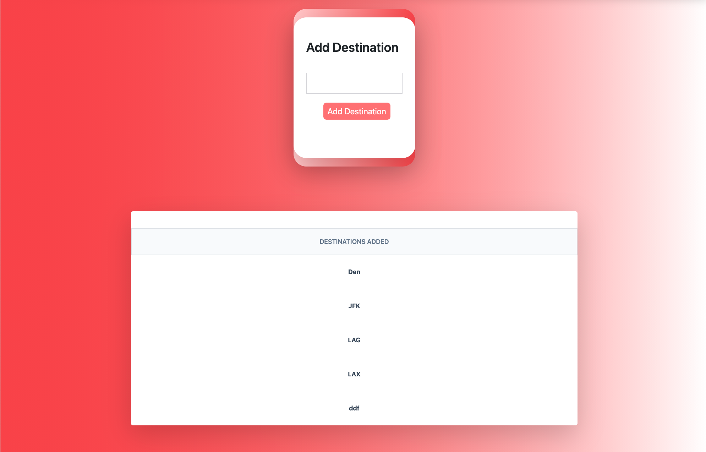

# Mongoose Flights
## Introduction

Mongoose Flights is a flight scheduling application using Express.Js, Node.Js, MongoDB and TailwindCSS. 

## Tech Framework
### This app uses:
* [Express.js](https://reactjs.org/)
* [TailwindCSS](https://tailwindcss.com/)
* [Node.js](https://nodejs.org/en/) v 14.17.1 & [Express](https://expressjs.com/) v 4.17.1

* [MongoDB](https://www.mongodb.com/cloud/atlas)
* [Mongoose](https://www.npmjs.com/package/mongoose)

* CSS
* Javascript
  
## This app is hosted at: 
* (https://goose-flights.herokuapp.com/)

## About the Developer

### Nick Rodriguez

Nick is a full stack web developer from the NYC area, with a passion for food, culture and technology. Nick decided to get into software development after after a 5 years in the Hospitality Management Industry. Learn more about Nick at these links:

* [LinkedIn](https://www.linkedin.com/in/nicholas-r-rodriguez/)
* [GitHub](https://github.com/nrayrod1016)

## Screenshots

This application was built as a part of General Assembly's Software Engineering Immersive Program.  

[Back to Top](#top)
